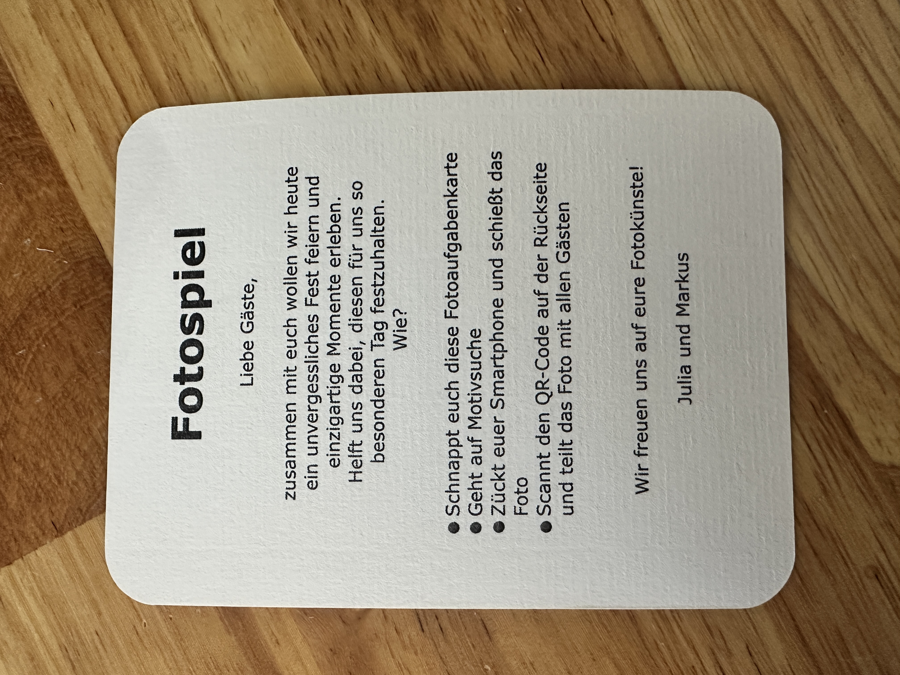

## Hochzeitsgalerie

A lightweight photo gallery web project for sharing wedding images and taking part of a photo mission game. 
Based on Python and Flask.

---

## Screenshots

Preview of the gallery interface:


An example image card used to help the wedding guests to find the website and show the individual mission they have to solve on the backside as a QR code:



---

## Features

- Simple, minimal gallery layout
- Uploads a stored locally in full resolution
- Automatic convertion to webp
- Single images can be downloaded in full resolution
- IP-based daily upload limit
- Single upload file count limit
- Upload status bar

---

## Quick start

These commands assume you have Python 3 installed. They use a virtual environment to keep dependencies isolated.

1. Create and activate a virtual environment

```bash
python3 -m venv .venv
source .venv/bin/activate
```

2. Install dependencies

```bash
pip install -r requirements.txt
```

3. Run the development server

```bash
python app.py
# or, to run via WSGI (production-like):
# pip install gunicorn
# gunicorn --bind 0.0.0.0:8000 wsgi:app
```

Open http://127.0.0.1:5000 (or the port `gunicorn` uses) in your browser.

---

## Project layout

- `app.py` — small Flask app entrypoint used for development
- `wsgi.py` — WSGI entrypoint suitable for running with Gunicorn / uWSGI
- `templates/` — HTML templates used by the app
- `static/` — static assets (CSS, JS, favicons)
- `example/` — example images and previews used in this README
- `requirements.txt` — Python dependencies

